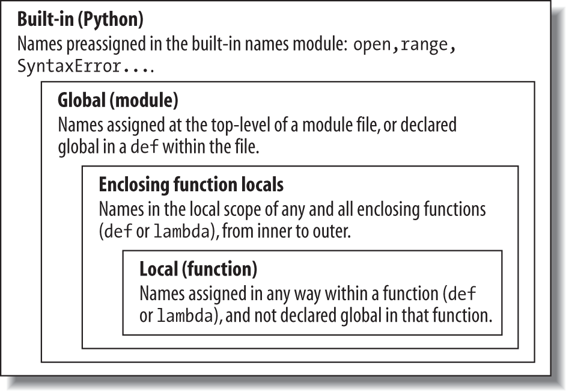

# Python scope

## Scopes
1. The enclosing module is a **global** scope.
    * The global scope spans a single file only.
1. When you create a variable in a function which has enclosing function, the scope of enclosing function is called **nonlocal**.
1. Assigned names in a function are **local** unless declared with keywords `global` or `nonlocal`.
    * Each call to a function creates a new local scope.
1. Most statement blocks (like `if` or `for` loop) **do not create scope** as in other languages as **go** or **c**. The below two blocks are exceptions, as they **do create scope**:
    * __Comprehension variables__: like X in `[x for x in l]`
    * __Exception variables__: like X in `except E as X`

## Hierarchy

